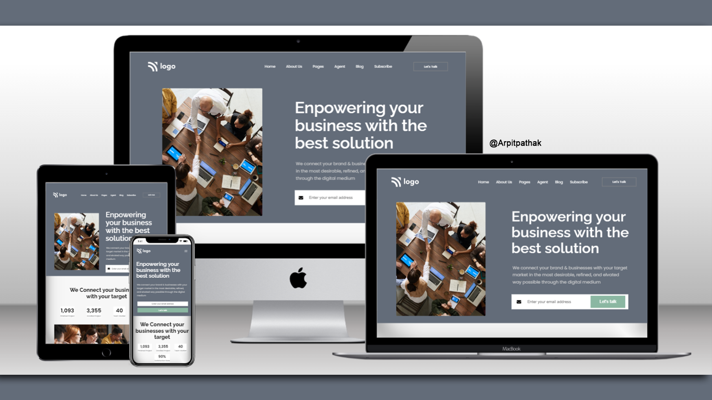

# Business Landing Page

## Project 12 🚀 Website's [Live Link](https://best-solutions.netlify.app/)🔗

>by Arpit Pathak

### Screenshot

### website on different devices

## 📌 What I learned from this Project? 📝
- Learned how to use `object-fit` and `object-position` properties.
- Learned to create complex footer section.
- Learned about Flexbox layout and its properties `justify-content`, `align-items` & `gap`.
- Learned to make cards.
- Learned about media query to make website responsive.

## 📌 Time taken to finish this project ⏳
- 6.5 hours + 1.5 hour to make website responsive
---

